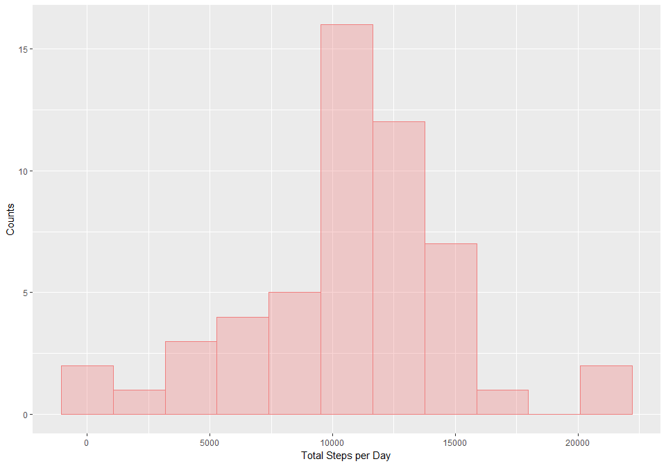
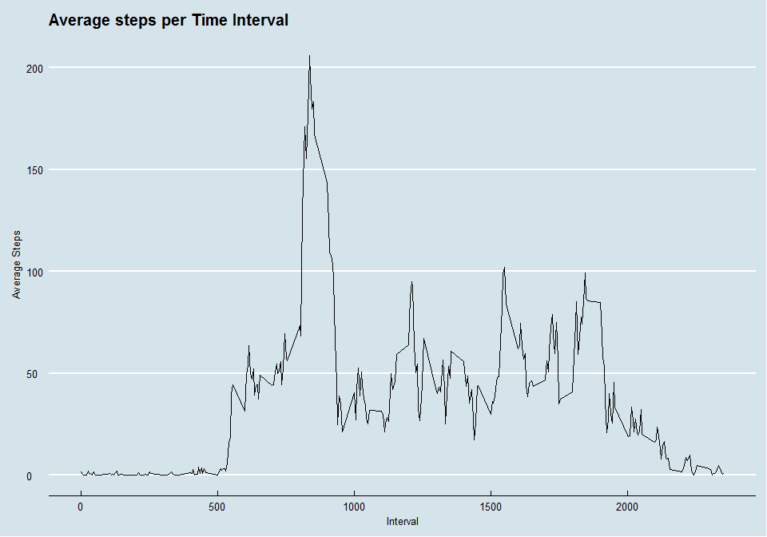
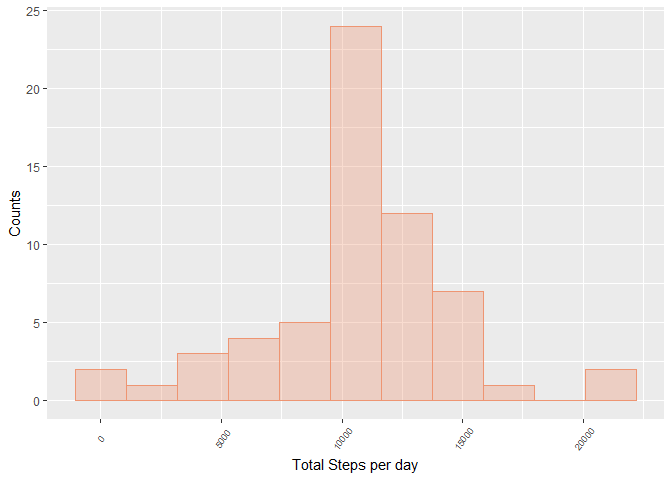
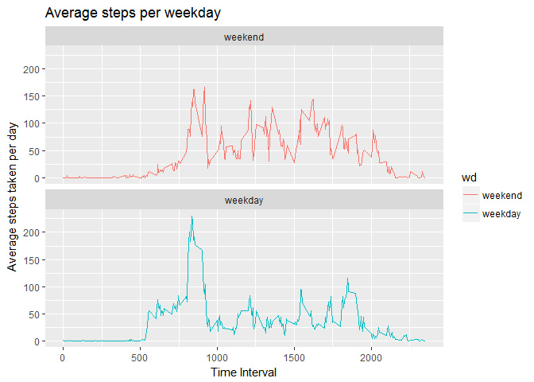

# Reproducible Research: Project 1
Priya Singh  
June 29, 2017  

Personal movement data from personal activity devices provide interesting measurements which can be used to improve health and identify patterns in behavior. Unfortunately, this data remains underutilized due to difficulty in data acquisition and a lack of appropriate statistical methods for data analysis.  


This report aims at identifying daily activity patterns, and differences in the activity patterns during weekdays and weekends. It is common to have missing values in the real world data. Special emphasis has been made on handling such missing values and a strategy for handling missing values has been proposed. In addition, this report has been generated using R Markdown and knitr package which can be used to prepare dynamic R reports.  


The data consists of two months of data from an anonymous individual collected during the months of October and November, 2012 and include the number of steps taken in 5 minute intervals each day.  


More information about the project can be found in the [ReadMe](https://github.com/rdpeng/RepData_PeerAssessment1/blob/master/README.md) on Github.


### **Load in the necessary packages**

```r
library(plyr)
library(dplyr)
```

```
## 
## Attaching package: 'dplyr'
```

```
## The following objects are masked from 'package:plyr':
## 
##     arrange, count, desc, failwith, id, mutate, rename, summarise,
##     summarize
```

```
## The following objects are masked from 'package:stats':
## 
##     filter, lag
```

```
## The following objects are masked from 'package:base':
## 
##     intersect, setdiff, setequal, union
```

```r
library(ggplot2)
library(lubridate)
```

```
## 
## Attaching package: 'lubridate'
```

```
## The following object is masked from 'package:plyr':
## 
##     here
```

```
## The following object is masked from 'package:base':
## 
##     date
```

```r
library(timeDate)
library(ggthemes)
```


### **Load and preprocess the data**  


Show any code that is needed to  
1. Load the data (i.e. read.csv())  
2. Process/transform the data (if necessary) into a format suitable for your analysis  


```r
## Read activity csv file
data.activity <- read.csv(file="O:/Study/CourseraDataScientist/5. Reproducible Research/repdata_data_activity_2/activity.csv")

## Convert to date class
library(lubridate)
data.activity$date <- ymd(as.character(data.activity$date))
```


Check data with str() and head()  

```r
str(data.activity)
```

```
## 'data.frame':	17568 obs. of  3 variables:
##  $ steps   : int  NA NA NA NA NA NA NA NA NA NA ...
##  $ date    : Date, format: "2012-10-01" "2012-10-01" ...
##  $ interval: int  0 5 10 15 20 25 30 35 40 45 ...
```

```r
head(data.activity)
```

```
##   steps       date interval
## 1    NA 2012-10-01        0
## 2    NA 2012-10-01        5
## 3    NA 2012-10-01       10
## 4    NA 2012-10-01       15
## 5    NA 2012-10-01       20
## 6    NA 2012-10-01       25
```


As we can see, the data is now ready for wokring on our project. It includes 17,568 observations of the following 3 variables:  
1. **steps**: Number of steps taking in a 5-minute interval (missing values are coded as NA)  
2. **date**: The date on which the measurement was taken in YYYY-MM-DD format  
3. **interval**: Identifier for the 5-minute interval in which measurement was taken  


### **I. Total number of steps taken per day**  
*For this part of the assignment the missing values can be ignored.*    
1. *Calculate the total number of steps taken per day.*  
2. *Make a histogram of the total number of steps taken each day.*  
3. *Calculate and report the mean and median total number of steps taken per day.*  


**1. Number of steps per day**  
Calculate total number of steps per day:  

```r
## Calculate total steps per day
steps.total <- aggregate(steps ~ date, data.activity, sum, na.rm=TRUE)
head(steps.total)
```

```
##         date steps
## 1 2012-10-02   126
## 2 2012-10-03 11352
## 3 2012-10-04 12116
## 4 2012-10-05 13294
## 5 2012-10-06 15420
## 6 2012-10-07 11015
```

 
**2. Plot histogram**  


```r
par(mar=c(5,4,1,1), las=1)
library(ggplot2)

r <- range(steps.total$steps)
s <- (r[2] -r[1])/10.0

a <- ggplot(steps.total, aes(steps))
a <- a+geom_histogram(binwidth = s, alpha=1/3,fill="lightcoral", color="lightcoral")
a <- a+labs(x="Total Steps per Day")+labs(y=expression("Counts"))
a
```

<!-- -->


**3. Calculate the mean and median of the total number of steps taken per day**  

```r
## Calculate mean and median steps
mean.daily.steps <- mean(steps.total$steps)
mean.daily.steps
```

```
## [1] 10766.19
```

```r
median.daily.steps <- median(steps.total$steps)
median.daily.steps
```

```
## [1] 10765
```


### **II. Average daily activity pattern**  
*1. Make a time series plot (i.e. type = "l") of the 5-minute interval (x-axis) and the average number of steps taken, averaged across all days (y-axis)*  
*2. Which 5-minute interval, on average across all the days in the dataset, contains the maximum number of steps?*  


**1. Time series plot of the 5 minute interval (x) and averaged number of steps taken averaged across all days (y)**  
1.a. Calculate the average number of steps taken in each 5-minute interval per day using `plyr` and group by `timeinterval()`  

```r
## Load plyr package
library(plyr)

## Remove missing values
compcases <- data.activity[!is.na(data.activity$steps),]

timeinterval <- ddply(compcases, .(interval),
                      summarize, Avg = mean(steps))
```


1.b. Use `ggplot` for making the time series of the 5-minute interval and average steps taken  

```r
par(mar=c(5,4,1,1), las=1)
## Plot line graph
library(ggthemes)
s <- ggplot(timeinterval, aes(x=interval, y=Avg))
s+geom_line()+ggtitle("Average steps per Time Interval")+xlab("Interval")+ylab("Average Steps")+
theme_economist()+scale_color_economist()  
```

<!-- -->


**2. 5-minute interval (on average across all the days) with the maximum number of steps**  
Use `max()` to find out the maximum steps, on average, across all the days  

```r
## Maximum steps interval
Maxsteps <- max(timeinterval$Avg)
Maxsteps
```

```
## [1] 206.1698
```

```r
timeinterval[timeinterval$Avg==Maxsteps,1]
```

```
## [1] 835
```


### **III. Imputing missing values**  
*Note that there are a number of days/intervals where there are missing values (coded as `NA`). The presence of missing days may introduce bias into some calculations or summaries of the data.*  
*1. Calculate and report the total number of missing values in the dataset (i.e. the total number of rows with `NAs`)*  
*2. Devise a strategy for filling in all of the missing values in the dataset. The strategy does not need to be sophisticated. For example, you could use the mean/median for that day, or the mean for that 5-minute interval, etc.*  
*3. Create a new dataset that is equal to the original dataset but with the missing data filled in.*  
*4. Make a histogram of the total number of steps taken each day and Calculate and report the mean and median total number of steps taken per day. Do these values differ from the estimates from the first part of the assignment? What is the impact of imputing missing data on the estimates of the total daily number of steps?*  
**1. Total number of missing values in the dataset**  
Calculate sum of all missing values  

```r
## Calculate total NA values
nasums <- sum(is.na(data.activity$steps))
nasums
```

```
## [1] 2304
```

**2. Devise a strategy for filling in all missing values in the dataset**  
**3. Create a new dataset that is equal to the original dataset but with the missing data filled in.**  
* Create a new dataset as the original and fill in the missing values with the average number of steps per 5-minute interval.  
* Fill in `NA` values with average number of steps per 5-minute interval.           

```r
## Create new dataset with NA values replaced by timeinterval
data.activity_nas.im <- mutate(data.activity, steps = replace(data.activity$steps,
                        is.na(data.activity$steps),
                         timeinterval$Avg))
```
Check there are no missing values  

```r
## Check new dataset
head(data.activity_nas.im)
```

```
##       steps       date interval
## 1 1.7169811 2012-10-01        0
## 2 0.3396226 2012-10-01        5
## 3 0.1320755 2012-10-01       10
## 4 0.1509434 2012-10-01       15
## 5 0.0754717 2012-10-01       20
## 6 2.0943396 2012-10-01       25
```

```r
## Check if NAs still exist
sum(is.na(data.activity_nas.im$steps))
```

```
## [1] 0
```


**4.a. Calculate the number of steps taken in each 5-minute interval per day. Use `ggplot` for making the histogram.**    

```r
## Calculate total steps per day
steps.total.na.im <- aggregate(steps~date, data.activity_nas.im, sum)
```


```r
## Plot histogram with ggplot2
s <- range(steps.total.na.im$steps)
t <- (s[2]-s[1])/10.0

b <- ggplot(steps.total.na.im, aes(steps))
b <- b+geom_histogram(binwidth = t, alpha=1/3, fill="lightsalmon2", color="lightsalmon2")
b <- b+labs(x="Total Steps per day", y="Counts")+theme(axis.text.x=element_text(angle = 50, size = 7, vjust = 0.5))
  print(b)
```

<!-- -->


**4.b. Calculate the mean and median steps with the filled in values.**  

```r
## Calculate mean and median of the daily steps
mean.steps.na.im <- mean(steps.total.na.im$steps)
mean.steps.na.im
```

```
## [1] 10766.19
```

```r
median.steps.na.im <- median(steps.total.na.im$steps)
median.steps.na.im
```

```
## [1] 10766.19
```

**Impact of imputing missing values in the dataset:**
The mean and median of data including missing values and *after* imputing missing values is shown below:  


Data set with missing values:  
Mean - 10766.19    ; Median - 10765  

Data set *after* imputing missing values:  
Mean - 10766.19     ; Median - 10766.19  


As we can see, there is little impact due to these missing value imputations. However, these impacts depend on the type of method used for imputing the missing values.
  


### **IV. Differences in activity patterns between weekdays and weekends**  

For this part the `weekdays()` will come handy. Use the dataset with the filled-in missing values for this part.  
*1. Create a new factor variable in the dataset with two levels - "weekday" and "weekend" indicating whether a given date is a weekday or weekend day.*  
*2. Make a panel plot containing a time series plot (i.e. type = "l") of the 5-minute interval (x-axis) and the average number of steps taken, averaged across all weekday days or weekend days (y-axis).*  

1.a. Create a new column, `wd` using `timeDate` and `factor()`. Identify whether a date is a weekday or a weekend.  

```r
## Create new weekday type factor variable
library(timeDate)

data.activity_nas.im$wd <- factor(isWeekday(timeDate(data.activity_nas.im$date)),
                                  labels=c("weekend", "weekday"))
head(data.activity_nas.im)
```

```
##       steps       date interval      wd
## 1 1.7169811 2012-10-01        0 weekday
## 2 0.3396226 2012-10-01        5 weekday
## 3 0.1320755 2012-10-01       10 weekday
## 4 0.1509434 2012-10-01       15 weekday
## 5 0.0754717 2012-10-01       20 weekday
## 6 2.0943396 2012-10-01       25 weekday
```
2.a. Calculate the average steps in the 5-minute interval.  
2.b. use ggplot for making the time series of the 5-minute interval for weekday and weekend, and compare the average steps.  

```r
## Calculate average steps per interval and week day
timeinterval.wd <- aggregate(steps~interval+wd, data.activity_nas.im, mean)
head(timeinterval.wd)
```

```
##   interval      wd       steps
## 1        0 weekend 0.214622642
## 2        5 weekend 0.042452830
## 3       10 weekend 0.016509434
## 4       15 weekend 0.018867925
## 5       20 weekend 0.009433962
## 6       25 weekend 3.511792453
```

```r
## Plot histogram with ggplot2
g <- ggplot(timeinterval.wd, aes(x=interval,y=steps, color=wd)) 
g <- g + geom_line(aes(color=wd))+facet_wrap(~wd, ncol=1, nrow=2)
g <- g + labs(title = "Average steps per weekday", x="Time Interval",y="Average steps taken per day") 
print(g)
```

<!-- -->


**Difference in activity patters between weekdays and weekends:** These two graphs clearly show difference between the activity patterns during weekdays and weekends. Weekends show more activities throughout the day as compared to the weekdays. Most of the weekday activities are during the mornings, right after the lunch, and in the evenings. In addition, on weekdays there is more activity during the earlier times of the day. While weekends, do not show same activity pattern during similar times of the day.  
